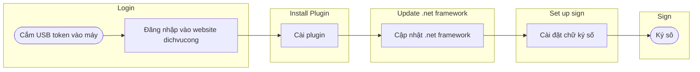

Phân tích dữ liệu do IT kết xuất

Hướng dẫn ký số trên trang dịch vụ công của Cục Quản lý dược

```mermaid
  graph LR
    subgraph Login
      direction TB
      A([Cắm USB token vào máy]) --> B[Đăng nhập vào website dichvucong];
    end
    subgraph Install Plugin
      B --> C[Cài plugin];
    end
    subgraph Update .net framework
      C --> D[Cập nhật .net framework];
    end
    subgraph Set up sign
      D --> E[Cài đặt chữ ký số];
    end
    subgraph Sign
      E --> F([Ký sô]);
    end
```
